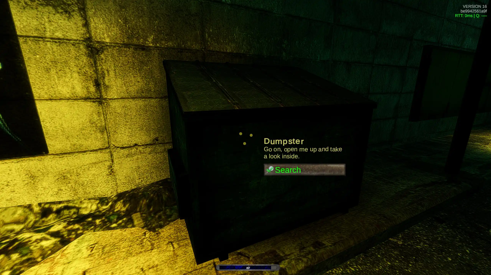
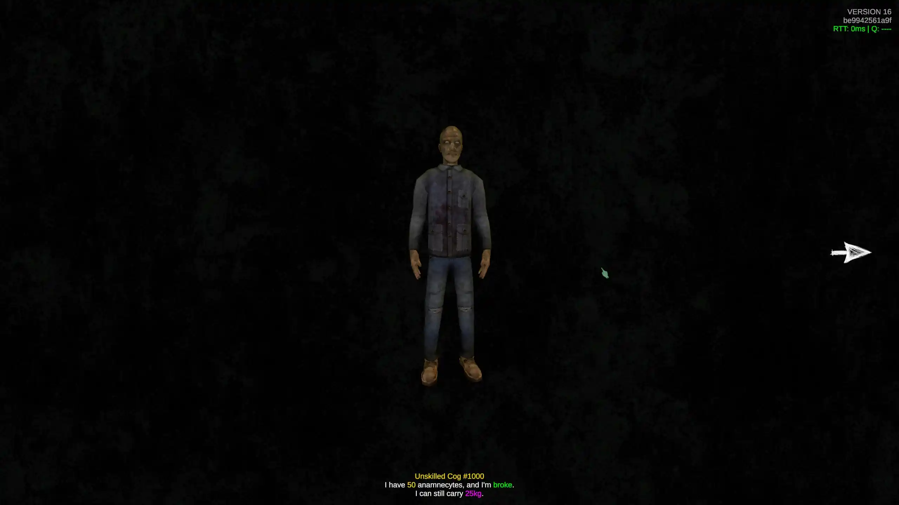

# No Fonts

This unsets all fonts in the game, forcing it to fallback to a much more pleasing default font.

## Installing

This project was built using BepInEx Bleeding Edge Artifact #738

It can be downloaded here: https://builds.bepinex.dev/projects/bepinex_be, ensure you download the one labeled with "IL2CPP" as ANEURISM IV is built with IL2CPP

Drop the BepInEx into your game folder, then download the mod from Releases on the right, then navigate to BepInEx/plugins and drop the mod in there

## Building

Place this project folder under https://github.com/FatigueDev/aneurism_iv_modding/ and follow `dotnet build` instructions
